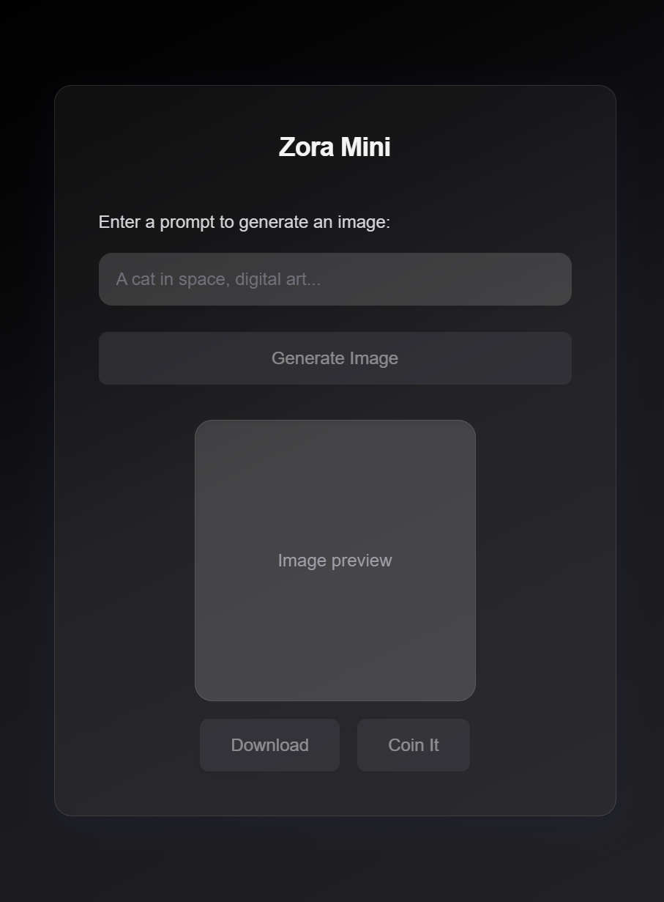
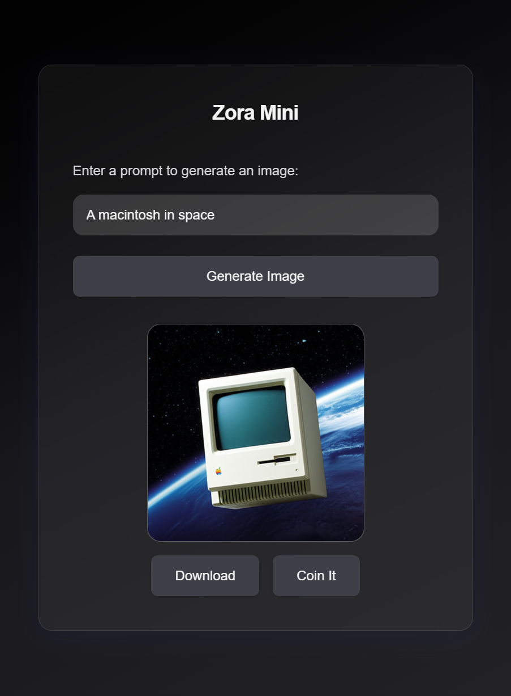
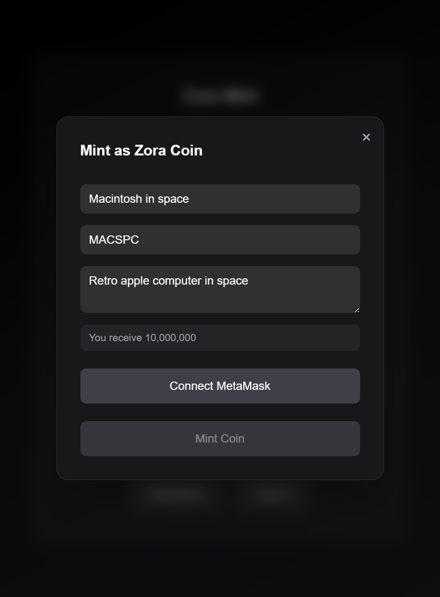
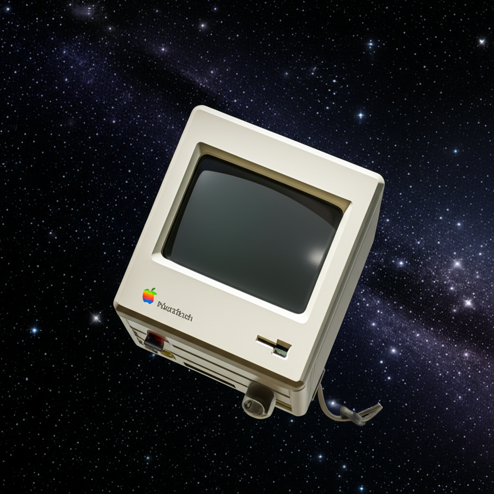

# Zora Mini

A simple project to interact with the Zora Coins SDK for minting coins, generating images, and performing blockchain operations using the Zora protocol.

---

## Project Screenshots

### UI Screenshots

|  |  |  |
|:--------------------------:|:------------------------------:|:-------------------------------:|
| Main Page                  | Result Page                    | Coin it Modal                   |

---

Below are example images generated by this app:

|  |  |
|:------------------------------:|:-------------------------------:|
| Dog in Space                   | Cat in Space                    |

|  |  |
|:-------------------------------:|:--------------------------------:|
| Google in Space                 | Raccoon in Space                 |

---

## About Zora

Zora is a decentralized protocol and platform that empowers anyone to create, mint, collect, and trade digital assets on the blockchain. Zora's mission is to make the creation and exchange of value on the internet open, permissionless, and accessible to everyone. Built on open-source principles, Zora provides tools and infrastructure for artists, developers, and communities to launch their own tokens, NFTs, and marketplaces without relying on centralized intermediaries.

### Why Zora?
- **Open and Permissionless:** Anyone can participate, mint, and trade without gatekeepers.
- **Creator-Centric:** Designed to maximize value for creators and communities.
- **Interoperable:** Works seamlessly with other protocols and platforms in the Web3 ecosystem.
- **Innovative:** Zora regularly launches new features, such as programmable coins and advanced NFT mechanics, to push the boundaries of digital ownership.

Zora's technology powers a wide range of applications, from generative art drops to community tokens and beyond, making it a foundational layer for the next generation of the internet.

---

## Getting Started

1. **Clone the repository:**
   ```sh
   git clone <your-repo-url>
   cd Zora-mini
   ```

2. **Install dependencies:**
   ```sh
   npm install
   ```

3. **Set up environment variables:**
   - Create a `.env.local` file in the root directory.
   - Add your Zora API key:
     ```env
     NEXT_PUBLIC_ZORA_API_KEY=your_zora_api_key_here
     ```

4. **Run the development server:**
   ```sh
   npm run dev
   ```
   The app will be available at [http://localhost:3000](http://localhost:3000).

## Troubleshooting
- If you encounter the error `'API key is required for metadata interactions'`, ensure your `NEXT_PUBLIC_ZORA_API_KEY` is set correctly in `.env.local` and available at runtime.

## License
MIT
